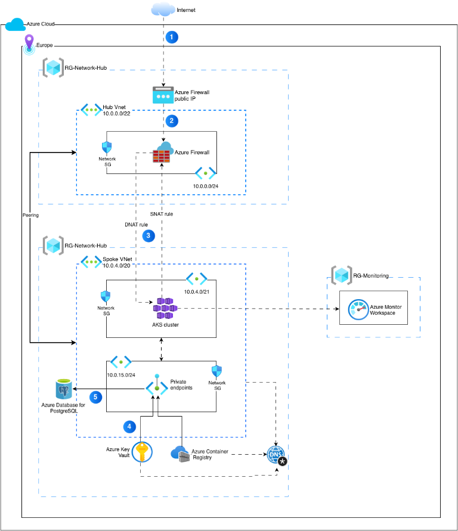
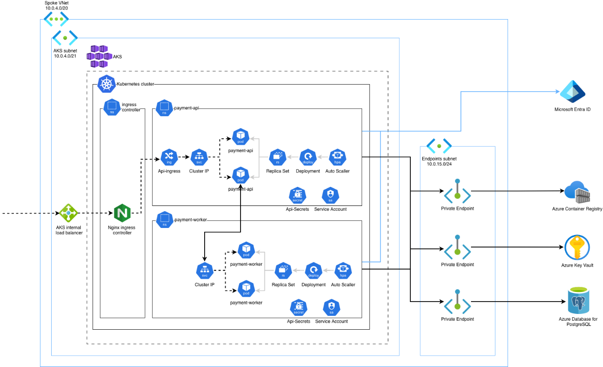

# 💳 payment-app

This project is a practical implementation of infrastructure for a web application, with a focus on:

- security and network isolation,
- ease of deployment and scaling,
- cloud resource automation,
- improved production environment operations,
- future expansion toward CI/CD and monitoring.

---

## 🧩 What does this project contain?

The repository includes:

- Helm configuration for deploying the application,
- Kubernetes templates and infrastructure resources,
- Terraform definitions for infrastructure management,
- application and network environments/configurations,
- ingress and cert-manager components, as well as external access support.

See also the key directories:

- [payment_app_infra](payment_app_infra)
- [payment_app_infra/application](payment_app_infra/application)
- [payment_app_infra/application/payment-app-chart](payment_app_infra/application/payment-app-chart)
- [payment_app_infra/terraform](payment_app_infra/terraform)

---

## 🏗️ Solution architecture

The diagrams below provide a general visualization of the project architecture.

### Diagram 1 — Azure network and infrastructure architecture



### Diagram 2 — Traffic flow in the AKS cluster



---

## 🛠️ Technology stack

- Kubernetes / AKS
- Helm
- Terraform
- Azure
- NGINX Ingress Controller
- cert-manager
- TLS / HTTPS
- Infrastructure as Code (IaC)

---

## 📁 Project structure

```text
payment-app/
├── payment_app_infra/
│   ├── application/
│   │   ├── cert-manager/
│   │   ├── nginx-ingress-controller/
│   │   └── payment-app-chart/
│   │       ├── Chart.yaml
│   │       ├── values.yaml
│   │       └── templates/
│   └── terraform/
├── README.md
└── docs/   # diagrams and visual documentation
```

---

## ⚙️ How to run the project

Requirements:

- Kubernetes / lokalny klaster (np. minikube, kind, AKS)
- kubectl
- Helm 3
- Terraform

Example local workflow:

```bash
# 1. Start the cluster
minikube start

# 2. Install cert-manager
kubectl apply -f https://github.com/cert-manager/cert-manager/releases/latest/download/cert-manager.yaml

# 3. Install ingress-nginx
kubectl apply -f https://raw.githubusercontent.com/kubernetes/ingress-nginx/controller-v1.*/deploy/static/provider/cloud/deploy.yaml

# 4. Install the Helm chart
cd payment_app_infra/application/payment-app-chart
helm install payment-app . --values values.yaml

# 5. Check the status
kubectl get pods
kubectl get svc
kubectl get ingress
```

If you use Terraform:

```bash
cd payment_app_infra/terraform
terraform init
terraform plan
terraform apply
```

---


